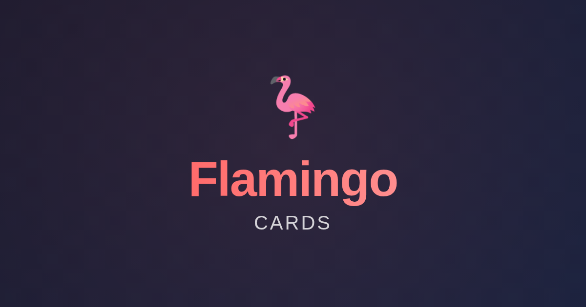
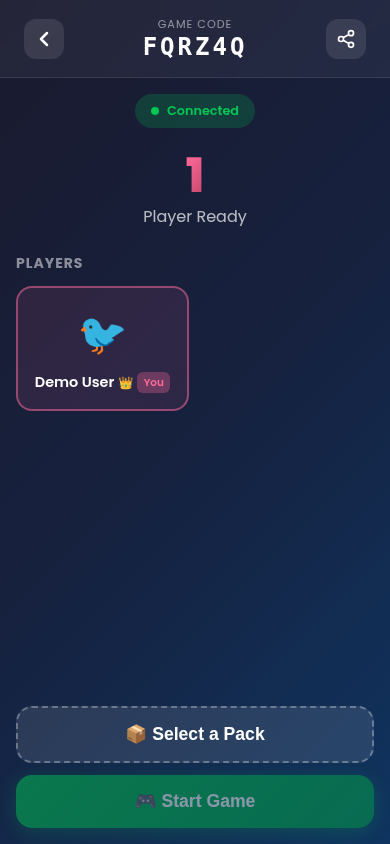
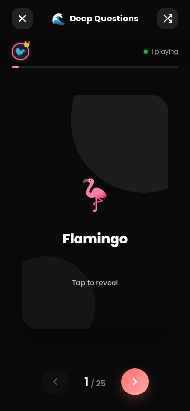

# Flamingo Cards

> A premium, real-time multiplayer card game for deep conversations and engaging social interactions.



**Flamingo Cards** is a modern web application designed to facilitate meaningful connections through curated questions and interactive challenges. The platform provides structured conversation prompts suitable for various social settings, from casual gatherings to intimate conversations.

## Features

- **Real-time Multiplayer**: Connect with friends instantly using a unique game code. No authentication required.
- **Live Synchronization**: Game state, card flips, and player actions are synchronized in real-time across all devices using [PartyKit](https://partykit.io/).
- **Diverse Card Packs**: Choose from a wide variety of themed packs including:
  - **Deep Questions**: For meaningful conversations and introspection.
  - **Couple's Convos**: To strengthen relationships and improve communication.
  - **Dare to Share**: Interactive challenges for adventurous participants.
  - **Unpopular Opinions**: Thought-provoking prompts to spark engaging debates.
  - Additional themed packs for various occasions and group dynamics.
- **Host Controls**: The host has administrative privileges to manage the game, change packs, and moderate participants.
- **Responsive Design**: Optimized user experience across mobile, tablet, and desktop devices.
- **Premium Aesthetics**: Modern dark-mode interface featuring smooth animations and glassmorphism design elements.

## Screenshots

|                       Lobby                       |                        Gameplay                         |
| :-----------------------------------------------: | :-----------------------------------------------------: |
|  |  |
|        _Join games and choose your avatar_        |           _Swipe through cards in real-time_            |

## Getting Started

Follow these steps to get the project running on your local machine.

### Prerequisites

- [Node.js](https://nodejs.org/) (v18 or higher)
- [npm](https://www.npmjs.com/)

### Installation

1. **Clone the repository**

    ```bash
    git clone https://github.com/yourusername/flamingo-cards.git
    cd flamingo-cards
    ```

2. **Install dependencies**

    ```bash
    npm install
    ```

3. **Start the development server**

    ```bash
    npm run dev
    ```

## Deployment

For instructions on how to deploy this project to production, please see [DEPLOY.md](DEPLOY.md).

    npm install
    ```

### Running Locally

To run the full application (Client + Server), you need to run both the Vite development server and the PartyKit server.

1. **Start the development server**

    ```bash
    npm run dev
    ```

    This will start the frontend at `http://localhost:5173`.

2. **Start the PartyKit server**

    ```bash
    npm run party
    ```

    This will start the backend server at `http://127.0.0.1:1999`.

> **Note:** Both the development server and PartyKit server must be running concurrently for multiplayer functionality.

## Tech Stack

- **Frontend**: [React](https://react.dev/), [Vite](https://vitejs.dev/), CSS Modules
- **Backend / Real-time**: [PartyKit](https://partykit.io/) (WebSockets, Durable Objects)
- **Routing**: [React Router](https://reactrouter.com/)
- **State Management**: React Hooks with WebSocket synchronization
- **Icons**: SVG and Unicode characters

## Project Structure

```sh
flamingo/
├── server/
│   └── game-room.ts       # PartyKit server logic (Game State, WebSocket handlers)
├── src/
│   ├── components/        # Reusable UI components (Card, CardPack, etc.)
│   ├── data/              # Static data (Question Packs)
│   ├── hooks/             # Custom hooks (useGameSync for WebSocket logic)
│   ├── pages/             # Application pages (Home, Lobby, Play)
│   ├── App.jsx            # Main app component and routing
│   └── main.jsx           # Entry point
├── partykit.json          # PartyKit configuration
└── package.json           # Project dependencies and scripts
```

## Contributing

Contributions are welcome. To contribute to this project:

1. Fork the repository
2. Create a feature branch (`git checkout -b feature/FeatureName`)
3. Commit your changes (`git commit -m 'Add FeatureName'`)
4. Push to the branch (`git push origin feature/FeatureName`)
5. Submit a Pull Request with a detailed description of your changes
